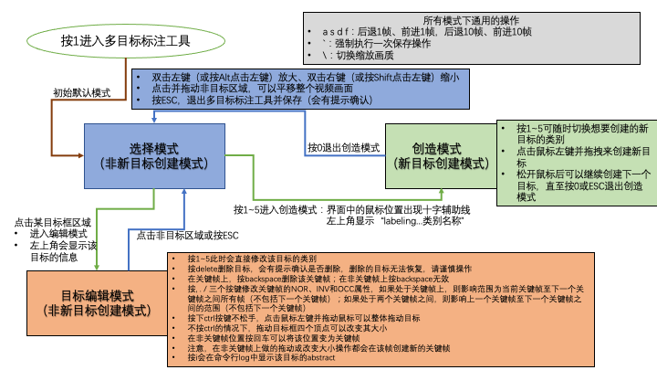

# 卫星视频标注工具
2022.5.12 更新 第一版发布内测版本 V1.1 beta
- 修复了文件保存bug，并加入了新的自动保存机制
- 为操作界面添加了更多可视化效果，标注过程更清晰容易

--- 
2022.5.14 更新 正式版本 V1.2 release
- 修复了在删除目标开头和结尾位置后无法保存文件的bug
- 修复了自动保存机制中的多线程bug
- 修复了部分可视化显示问题
- 更新了操作文档
- 修改了拖动模式，无需再按ctrl即可拖动画面
- 添加了强制保存操作
- 修复了delete操作bug
- 修复了backspace删除目标点的显示问题
- 优化了部分操作手感和习惯
此版本已经基本可靠，等待后续实际使用效果。

---
2022.5.16 更新 正式版本补充版本 V1.2.1 release
- 按v可以切换是否显示前后KeyPoint框（针对目标前后帧距离较近的情况，影响目标标注）
- 按z和x可以快速回到第一帧或最后一帧


# Python环境需求(没有标注具体版本的安装默认最新即可)
- python == 3.8.*  （这个很重要，一定要是3.8版本的，否则下面的一些版本会对不上）
- opencv-python == 4.5.5.62
- numpy == 1.22.*
- matplotlib
- coloredlogs
- opencv-contrib-python == 4.5.5.64
- pillow == 9.0.*
- pyyaml
- tqdm

我们提供了requirement.txt文件，您可以直接在python环境中通过pip来安装他们：
``` shell
pip install -r requirements.txt -i https://mirrors.aliyun.com/pypi/simple
```

# 配置与进入

## 配置文件video_target_selector.yaml
在配置完成上述环境之后，您还需要修改configs/video_target_selector.yaml文件
下面是一个配置模板，如果您的配置文件不小心被损坏，可以重新copy一份覆盖：

``` yaml
VideoFilePath: '/data1/ORSV/part2/ori/JL103B_MSS_20180104153259_100003219_102_001_L1B_MSS.avi'
ImageSequence: '.tiff'  # 如果上面的路径是视频文件，则该项无效
SaveToDirectory: 'annotations'    # 标注数据将保存在该文件夹中annotations文件夹内，其他辅助数据将存放在此路径
TargetFolderName: 'targets'   # 存放标注目标的文件夹

SelectArea: [4000,4000,6000,5000]   # x,y, xx ,yy
AnnotatorWinHeight: 600
AnnotatorWinWidth: 1200
TargetClasses:
  - ['vehicle', [255, 0, 0]]
  - ['large-vehicle', [0, 255, 0]]
  - ['ship', [0, 0, 255]]
  - ['airplane', [255, 255, 0]]
  - ['train', [255, 0 ,255]]

CacheDirectory: 'tmp'
CacheImage: '.tiff'

WindowSize: [1200, 600]  # 主界面的窗口尺寸，不要修改

VideoFormat: ['.mp4', '.MP4', '.avi', '.AVI']  # 视频格式，不要修改
ErrorFrame: 'skip'   # skip, interpolation, stop  # 不要修改

# Frame Settings
StartScale: 1.0   # 不要修改
ScaleList: null    # 不要修改

AutoSaving: 10000 # 自动保存间隔的毫秒数 1秒 = 1000毫秒，如果设置为0或小于0的数则取消自动保存（手动保存模式需要手动按保存按键或退出的时候自动保存）
```

其中您可以修改的是：
- VideoFilePath：视频的完整路径
- ImageSequence：如果VideoFilePath为视频文件，则无需设置此项；如果VideoFilePath是一个图片序列所在文件夹，那么请设置此项为文件夹中目标图像的后缀
- SaveToDirectory：打算将标注软件产生的输出保存到的路径（相对路径默认为相对于项目所在文件夹）
- TargetFolderName：标注结果存放的文件夹名称
- SelectArea：打算标注的区域（相对于VideoFilePath视频的crop区域）[左上角x1，左上角y1，右上角x2，右上角y2] 注意：0 <= x1 < x2 < video_width; 0 <= y1 < y2 < video_height
- AnnotatorWinHeight，AnnotatorWinWidth: 标注时候可见的（经过缩放后的）视野范围的高和宽，即窗口的大小
- TargetClasses： 目标类别名称不要修改，您可以修改后面的颜色显示，[bule，green，red]
- CacheDirectory：缓存存放的目录（绝对路径和相对路径均可）
- CacheImage：缓存图像保存的格式，建议tiff，最小的无损图像
- AutoSaving：自动保存的时间间隔，建议10s，不建议太频繁


## 运行程序
运行程序请在项目根目录下运行（即在sv_dataset_tools文件夹中运行，不要在其他目录或子文件夹中运行）
```
python run_video_annotator.py
```


# 主界面
标注工具的引导界面，在这个界面中可以进行：
- 1: 进入多目标视频标注工具
- 2: 重新从缓存加载目标（适用于手动在程序外修改了目标的meta文件后需要重新加载的情况）
- 3: 制作标注结果视频（未实现）
- b: 测试并设置键盘键位
- q: 退出

# 按键矫正
为了适应在不同操作系统环境下的按键映射差异，我们为按键加入了矫正操作，在主界面按b即可进入，进入后按照上面的中文提示进行按键（一定要看提示操作噢！）
- 0: 跳过当前的按键设置
- q: 退出矫正模式，不保存

# 多目标标注模式
多目标标注提供以下功能：
1. 支持对指定区域SelectArea范围内，平移、缩放图像，加载任意缩放图像的效率与打开原始图片的速度近似
2. 标注TargetClasses中设定的类别--矩形框标注--存储为小数坐标--存储为meta后缀的json文件
3. 可在同一个视频的任意位置进行标注，标注的结果将会被换算至相对于原始视频的绝对坐标，因此可以用于改造成任何其他范围的数据
4. 支持标注帧级别的属性，标注目标的可见、模糊消失、遮挡不可见三种状态
5. 采用关键帧标注方式，对目标的标注过程进行管理，以尽可能便捷地跟踪目标的状态变化，使得目标运动更平稳

## 按键设置
- a s d f：后退一帧，前进一帧，后退10帧，前进10帧
- ESC：是一个多功能的退出按键，可以用于退出多目标标注模式，也可以用于取消某些过程（画面上会有提示）
  - 退出程序，根据提示，再按ESC取消退出，按Enter回车确认退出，注意：退出的时候会再次执行保存结果操作，以防止自动保存未生效；另外一定要注意，一定要通过ESC正常途径退出，切忌直接kill掉程序，可能会导致结果保存出现问题！
  - 取消某些过程，如：取消删除目标，取消退出程序，取消当前选择，取消标注新目标
- i: 显示目标的abstract信息
- , . /：这三个按键分别用来标注NOR（正常可见）、INV（模糊与背景融为一体而难以辨别）、OCC（被遮挡不可见）
- Delete：先选择某个目标，然后按该按键可以删除目标。删除时会有提示确认是否删除，删除后的目标无法恢复，请谨慎操作。
- Ctrl+鼠标左键拖动：在选中某个目标的情况下，这样操作可以对目标进行整体拖拽。注意：如果位于非关键帧拖拽，将会在该帧创建新关键帧。
- 非新目标创建模式下，在非目标框区域双击鼠标左键：放大画面（推荐用法）
- 非新目标创建模式下，在非目标框区域双击鼠标右键：缩小画面（推荐用法）
- 非新目标创建模式下，按住Alt按键点击鼠标左键：放大画面（为上面方法的补充方法）
- 非新目标创建模式下，按住Shift按键点击鼠标左键：缩小画面（为上面方法的补充方法）
- \：切换画质，按一下按顺序切换一个，您需要大约在500%以上的缩放比才能看出效果差异。opencv-python == 4.5.5.62 版本具有这些画质选项：'Lanczos4', 'Cubic', 'Area', 'Linear_Exact', 'Nearest_Exact'，其中Lanczos4最细腻最慢，电脑好的可以选择该选项。
- Backspace退格键：在选择目标后，处于关键帧时，用来删除该关键帧；不能在非关键帧执行删除操作
- 数字按键1~5：进入对应类别的新目标创建模式，分别按顺序对应TargetClasses中的类别
- 数字0：退出创建新目标模式
- `（位于主键盘区数字键1左边）：强制执行一次保存操作，执行完后会打印日志显示有多少目标被保存
- 非新目标创建模式下，点击非目标区域并拖动：拖动视频平移
- 【新增！】按v可以切换是否显示前后关键帧的矩形框
- 【新增！】按z和x可以快速回到第一帧或到最后一帧

## 操作逻辑



## 存储的meta文件中的属性

标注好的目标被保存在后缀为.meta的json文件中，其中的数据格式如下：

_max_length 是目标对应的视频序列的长度

``` python
rect_poly_points: ndarray = -np.ones((_max_length, 4, 2), dtype='float')
create_timestamp: long = time.time()
class_name: str = ''
name: str = _rand_name()
start_index: int = -1  # 是目标最开始出现的帧的索引
end_index: int = -1    # 是目标最后消失前的最后一帧的索引
state_flags: ndarray = -np.ones(_max_length, dtype='int')  # -1 未标注 0 NOR 1 INV 2 OCC
key_frame_flags: ndarray = -np.ones((_max_length, 3), dtype='int')  # (pre_index, next_index, -1 未标注 1 关键帧 0 非关键帧)
```